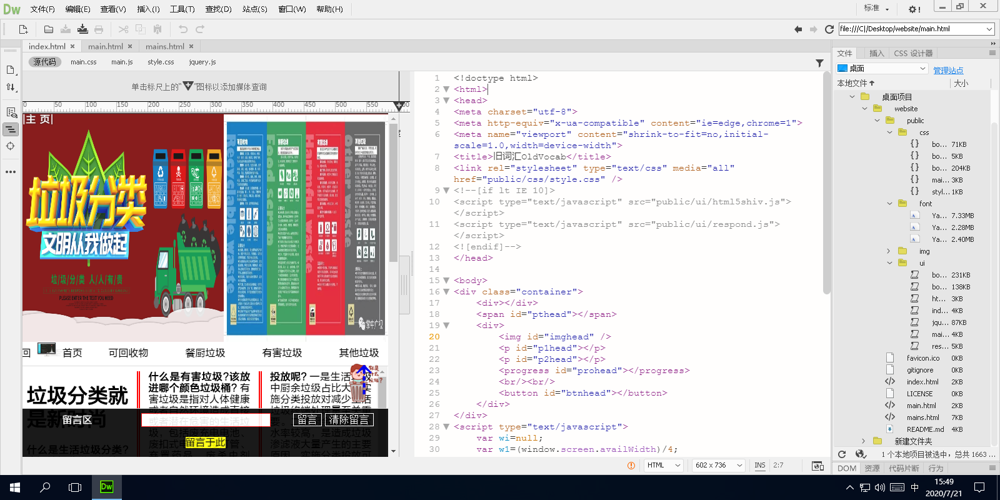
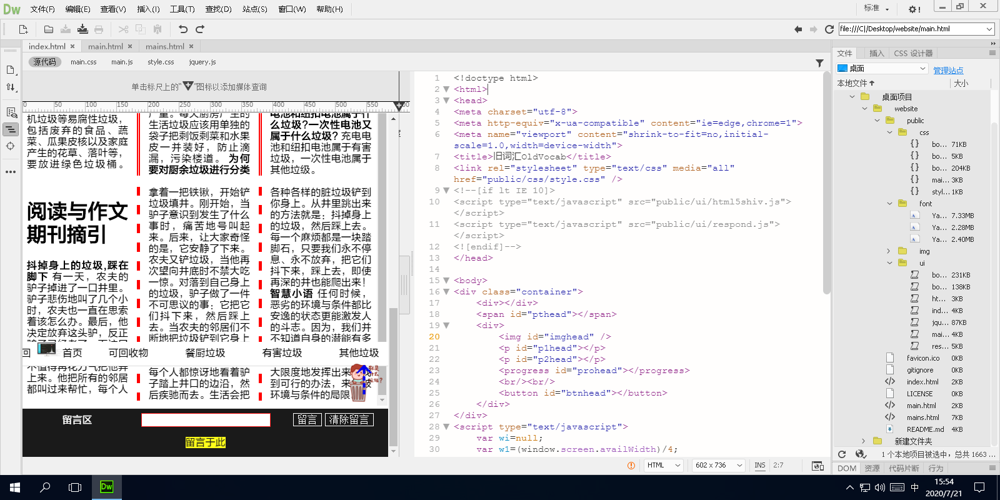
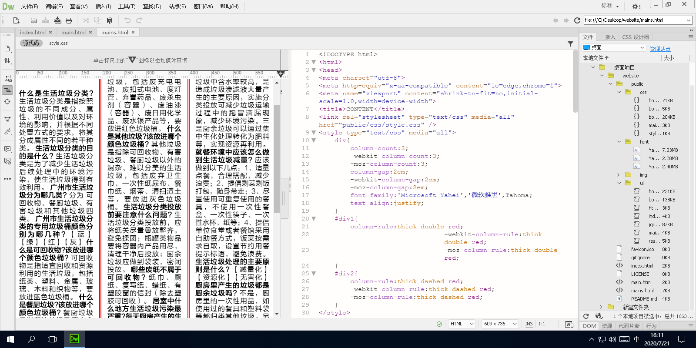

# GarbageSorter

 
垃圾分类web前端  消息！《广州市居民家庭生活垃圾分类投放指南》新版来了。特别为此宣传给市民。

#### 集成环境

| 编辑器 | 版本 | 平台 |
| :-: | :-: | :-: |
| Creative Cloud | v5.1.0.407 | Windows |
| Dreamweaver CC | v18.2 | Windows |
| Sublime Text | v3.2.2 | Windows x64 |
| Visual Studio Code | v1.47.2 | Windows x64 |

#### 重要技术

> _bootstrap_  
> 利用 Bootstrap 构建快速、响应式的网站，具体情况：
- Bootstrap 是全球最受欢迎的前端开源工具库，它支持 Sass 变量和 mixin、响应式栅格系统、自带大量组件和众多强大的 JavaScript 插件
- 基于 Bootstrap 提供的强大功能，能够让你快速设计并自定义你的网站

#### [简介 · Bootstrap v4.5](https://v4.bootcss.com/docs/getting-started/introduction/)

#### 软件架构

├─LICENSE `许可证`
***
├─favicon.ico `网站图标`
├─index.html `关于`
├─main.html `主页`
├─mains.html `内容`
├─public `公用资源`
|   ├─ui `JavaScript(脚本)`
|   | ├─bootstrap.bundle.js
|   | ├─bootstrap.js
|   | ├─popper.js
|   | ├─jquery.jqzoom.js
|   | ├─jquery.js
|   | ├─respond.js
|   | ├─html5shiv.js
|   | ├─main.js
|   | └index.js
|   ├─img `图像`
|   |  ├─goahead.png
|   |  ├─img1head.png
|   |  ├─img2head.png
|   |  ├─img3head.png
|   |  ├─img4head.png
|   |  ├─imghead.png
|   |  ├─imghead1.jpg
|   |  ├─imghead2.jpg
|   |  ├─imghead3.jpg
|   |  ├─imghead4.jpg
|   |  ├─imghead5.jpg
|   |  ├─imghead6.jpg
|   |  ├─imgnav.png
|   |  ├─imgnav1.png
|   |  ├─imgnav2.png
|   |  ├─imgnav3.png
|   |  ├─imgnav4.png
|   |  ├─welcome.png
|   |  └schoolview.png
|   ├─font `字体`
|   |  ├─Yahei1.TTF
|   |  ├─Yahei2.TTF
|   |  └Yahei3.TTF
|   ├─css `CSS(脚本)`
|   |  ├─bootstrap-grid.css
|   |  ├─bootstrap-reboot.css
|   |  ├─bootstrap.css
|   |  ├─popper.css
|   |  ├─jquery.jqzoom.css
|   |  ├─main.css
|   |  └style.css

#### 运行结果

#### 安装教程

1.  xxxx
2.  xxxx
3.  xxxx

#### 使用说明

1.  xxxx
2.  xxxx
3.  xxxx

#### 参与贡献

1.  Fork 本仓库
2.  新建 Feat_xxx 分支
3.  提交代码
4.  新建 Pull Request
